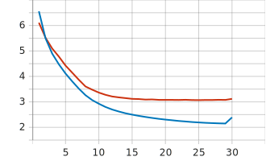

# 文言文翻译项目

## 1. 简介

本项目是基于 pytorch 版本的 Transformer 实现的从文言文翻译至白话文的机器学习项目。

## 2. 数据

模型所用数据来源于[古诗文网](https://www.gushiwen.cn/)，其相关爬虫脚本 [crawl.py](data/crawl.py) 修改自开源仓库：[文言文（古文）- 现代文平行语料](https://github.com/NiuTrans/Classical-Modern)。

本仓库提供了清洗完成后的原文 [src.txt.zip](data/src.txt.zip) 数据文件和译文 [tgt.txt.zip](data/tgt.txt.zip) 数据文件，解压后可直接用于[预处理](#预处理)步骤。

如果想自己复现数据集，可运行以下指令：

```sh
# 运行爬虫
python data/crawl.py
# 清洗数据
python data/clean.py
```

清洗数据的样例输出：

```
Number of files: 17,884
Number of samples before deduplicate: 152,139
Number of samples after deduplicate: 142,672 (9,467 deleted)
Number of vocabulary: 13,326
Number of words: 66,449,654
First 10 vocabs:
['、', '。', '々', '《', '》', '㐌', '㐨', '㑊', '㑛', '㑹']
Last 10 vocabs:
['𤣱', '𤸷', '𥉸', '𦈡', '𧄍', '𧿒', '𩇕', '𩩲', '𩿨', '𬯎']
```

## 3. 快速开始

### 安装依赖

```sh
pip install -r requirements.txt
```

### 预处理

```sh
python 1_preprocess.py
```

预处理的样例输出（vocab_size=16,384）：

```
[2024-06-27 12:51:37] 🌟 Preprocessing
[2024-06-27 12:54:31] Vocab size: 16,384
[2024-06-27 12:54:31] Total sentence pairs: 145,203
[2024-06-27 12:54:31] Total src_tokens: 16,350,224
[2024-06-27 12:54:31] Total tgt_tokens: 20,993,751
[2024-06-27 12:54:31] Token utilization: 71.36%
[2024-06-27 12:54:31] Train data has 130,682 sentences
[2024-06-27 12:54:31] 	max_src_len: 1023
[2024-06-27 12:54:31] 	max_tgt_len: 1023
[2024-06-27 12:54:31] Valid data has 14,521 sentences
[2024-06-27 12:54:31] 	max_src_len: 1023
[2024-06-27 12:54:31] 	max_tgt_len: 1023
```

_注：确保[data](data)文件夹里有解压后的 src.txt 和 tgt.txt 文件。_

### 训练

单机单卡训练：

```sh
python 2_train.py
```

单机多卡训练（以 8 卡为例）：

```sh
torchrun --standalone --nproc_per_node=8 2_train.py
```

训练结果：



样例输出详情见[log.txt](results/log.txt)。

### 生成

样例 1：

```sh
python 3_generate.py --input-text '我见青山多妩媚，青山见我应如是。'
```

样例 1 输出：

```
[2024-06-28 12:08:14] Input:
我见青山多妩媚，青山见我应如是。
[2024-06-28 12:08:14] Output:
我看到青山很妩媚，青山看我应该如此。
```

样例 2：

```sh
python 3_generate.py --input-text '话说天下大势，分久必合，合久必分。周末七国分争，并入于秦。及秦灭之后，楚、汉分争，又并入于汉。汉朝自高祖斩白蛇而起义，一统天下，后来光武中兴，传至献帝，遂分为三国。推其致乱之由，殆始于桓、灵二帝。桓帝禁锢善类，崇信宦官。及桓帝崩，灵帝即位，大将军窦武、太傅陈蕃共相辅佐。时有宦官曹节等弄权，窦武、陈蕃谋诛之，机事不密，反为所害，中涓自此愈横。'
```

样例 2 输出：

```
[2024-06-28 12:09:55] Input:
话说天下大势，分久必合，合久必分。周末七国分争，并入于秦。及秦灭之后，楚、汉分争，又并入于汉。汉朝自高祖斩白蛇而起义，一统天下，后来光武中兴，传至献帝，遂分为三国。推其致乱之由，殆始于桓、灵二帝。桓帝禁锢善类，崇信宦官。及桓帝崩，灵帝即位，大将军窦武、太傅陈蕃共相辅佐。时有宦官曹节等弄权，窦武、陈蕃谋诛之，机事不密，反为所害，中涓自此愈横。
[2024-06-28 12:09:55] Output:
话说天下大势，分年一定结合，时间久了一定分成两半。周朝末期七国分成两半，合并入秦。等到秦朝灭亡之后，楚汉分裂争夺，又都归于汉朝。汉朝自高祖斩白蛇起义，统一全国，后来光武中兴，传到汉献帝，于是分为三国。推究导致祸乱的根源，大概开始于桓帝、灵帝二帝。桓帝禁锢善类，尊崇信任宦官。桓帝桓帝驾崩，灵帝即位，大将军窦武、太傅陈蕃共同辅佐。当时宦官曹节等人玩弄权势，窦武、陈蕃阴谋诛杀他们，曹节等人的阴谋不严密，反而被他们杀害，宦官们从此更加骄横。
```

_注：以上样例预设 temperature=1.0, top_p=0.3。_

样例输出详情见[log.txt](results/log.txt)。
